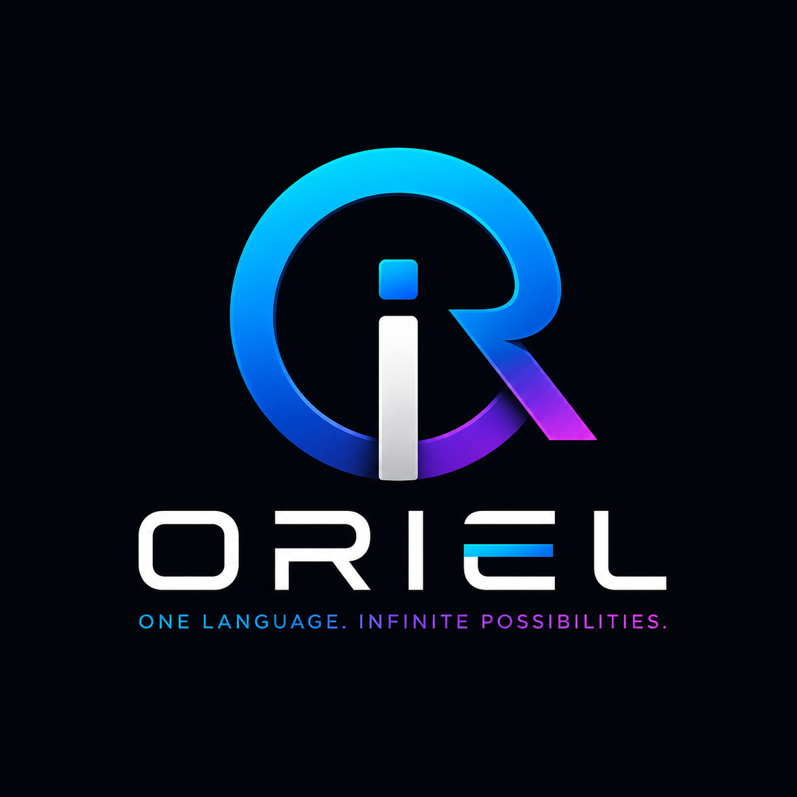

<p align="center"></p>

# ORIEL Software Language

**One Language. Infinite Possibilities.**

ORIEL is an experimental open-source programming language and development ecosystem. This repository consolidates the current Python bootstrap implementation, VS Code extension source, tests, examples, architecture documents, historical source snapshots, and release artifacts.

## Current verified baseline

The active codebase in `src/oriel/` is the ORIEL **0.7.1 bootstrap implementation**. Historical versions are preserved in `versions/`. Release files are stored in `release-assets/` for convenience; on GitHub they should normally be attached to Releases.

> Status: usable prototype and engineering baseline, not yet a production-stable language.

## Repository map

```text
src/oriel/             Active compiler/interpreter, CLI, services and LSP bootstrap
stdlib/                Planned official standard-library modules
frameworks/            Planned API, DB, Web, Desktop, Mobile, Data, AI and Cloud packages
vscode-extension/      VS Code extension source
versions/              Historical source snapshots
release-assets/        Existing wheel, VSIX and source ZIP builds
tests/                 Automated test suites
examples/              Example .orl programs
docs/                  Architecture, language and release documentation
.github/workflows/      CI and release automation
```

## Local setup

```powershell
python -m venv .venv
.\.venv\Scripts\Activate.ps1
python -m pip install --upgrade pip
python -m pip install -e .
python -m pytest
oriel version
oriel run examples\hello.orl
```

Linux/macOS activation:

```bash
source .venv/bin/activate
```

## Build the Python package

```bash
python -m pip install build
python -m build
```

## Build the VS Code extension

```bash
cd vscode-extension
npm install
npx @vscode/vsce package
```

## Release policy

A feature is marked implemented only when source code exists, automated tests pass, documentation is updated, and a tagged release can reproduce the published artifacts.

See [Architecture](docs/ARCHITECTURE.md), [Roadmap](docs/ROADMAP.md), and [Contributing](CONTRIBUTING.md).


## Stabilization status

ORIEL 0.7.1 includes a verified audit of the bootstrap lexer, parser, AST, runtime, diagnostics, and initial type checker. See `docs/AUDIT_0.7.1.md`.
