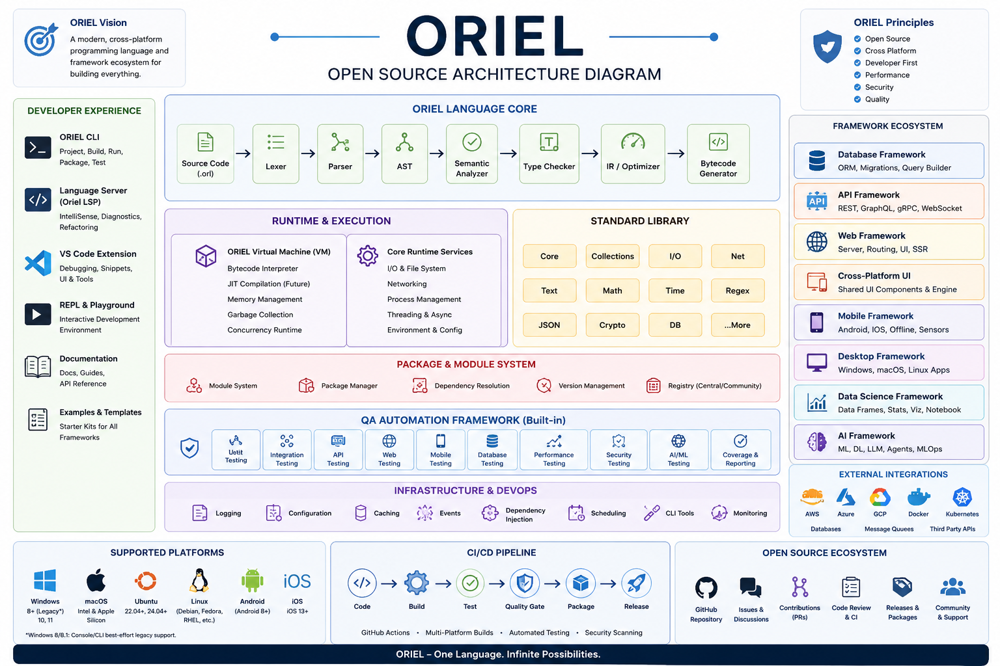

# ORIEL Open-Source Architecture

The architecture below replaces the previous text-only architecture diagram and represents the complete ORIEL engineering direction through the 0.8.1 baseline.

## Architecture layers

### Developer experience

The CLI, Language Server, VS Code extension, REPL, playground, documentation, examples and templates provide a consistent developer-facing experience while reusing shared compiler and runtime services.

### ORIEL language core

ORIEL source code flows through the lexer, parser, AST, semantic analyzer, type checker, intermediate representation, optimizer and bytecode generator. Compiler logic remains independent from IDE-specific clients and high-level frameworks.

### Runtime and execution

The ORIEL virtual machine and runtime services provide bytecode interpretation, file and network I/O, process management, concurrency, environment configuration, memory management and future JIT compilation support.

### Standard library

The standard library is organized into reusable modules including core, collections, I/O, networking, text, math, time, regular expressions, JSON, cryptography and database utilities.

### Package and module system

Modules, package management, dependency resolution, version management and registry integration form the distribution foundation for ORIEL applications and frameworks.

### QA automation framework

Testing is built into the platform and covers unit, integration, API, web, mobile, database, performance, security, AI/ML, coverage and reporting workflows.

### Framework ecosystem

The planned ecosystem includes database, API, web, cross-platform UI, mobile, desktop, data science and AI frameworks built above the stable language core, runtime and standard library.

### Infrastructure and DevOps

Logging, configuration, caching, events, dependency injection, scheduling, command-line tooling and monitoring provide shared operational services. CI/CD includes build, test, quality gates, packaging, security scanning and release automation.

### Platforms and integrations

ORIEL targets Windows, macOS, Ubuntu/Linux, Android and iOS, with external integration paths for cloud platforms, containers, Kubernetes, databases, message queues and third-party APIs.

## Dependency rules

- The lexer must not depend on the parser.
- The parser depends only on source services, tokens, diagnostics and AST definitions.
- Semantic analysis and type checking operate on the AST and symbol/type systems.
- IR and bytecode generation depend on typed compiler structures, not on editor clients.
- The runtime must not depend on the CLI, IDE extensions or application frameworks.
- The CLI and LSP coordinate shared services but contain no duplicated compiler logic.
- IDE support should use thin adapters around the shared Language Server and Debug Adapter services.
- Frameworks depend on the language runtime and standard library; the compiler core never depends on frameworks.

## Active 0.8.1 mapping

The active implementation is maintained under `src/oriel/`. Historical snapshots are preserved under `versions/` where available. The current repository also contains the VS Code extension source, tests, examples, release artifacts and version-specific documentation required to trace development from 0.1.0 through 0.8.1.

## Implementation note

The diagram represents both implemented capabilities and the broader open-source platform architecture. Detailed implementation status must be verified against `IMPLEMENTATION_STATUS.md`, `VERSION_HISTORY.md`, the changelog and version-specific verification documents. Planned features must not be presented as production-complete until their tests and release gates pass.
